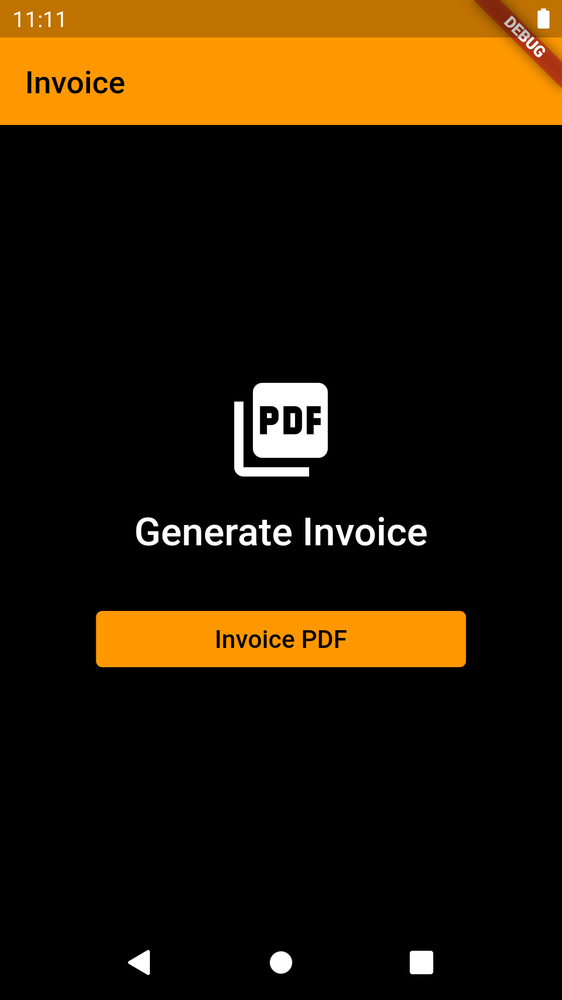

# invoice_pdf_generate

A new Flutter project.

<table>
  <tr>
    <td></td>
    <td></td>
  </tr>
 </table>

 

## Getting Started

This project is a starting point for a Flutter application.

A few resources to get you started if this is your first Flutter project:

For help getting started with Flutter, view our
[online documentation](https://flutter.dev/docs), which offers tutorials,
samples, guidance on mobile development, and a full API reference.
